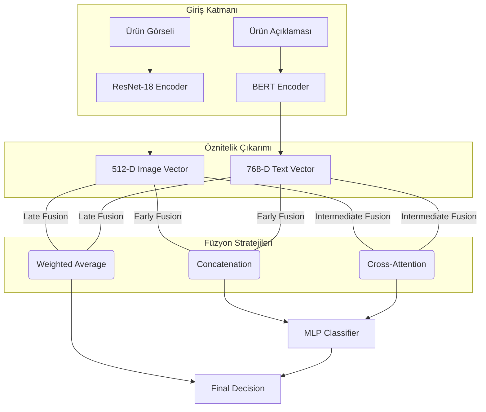
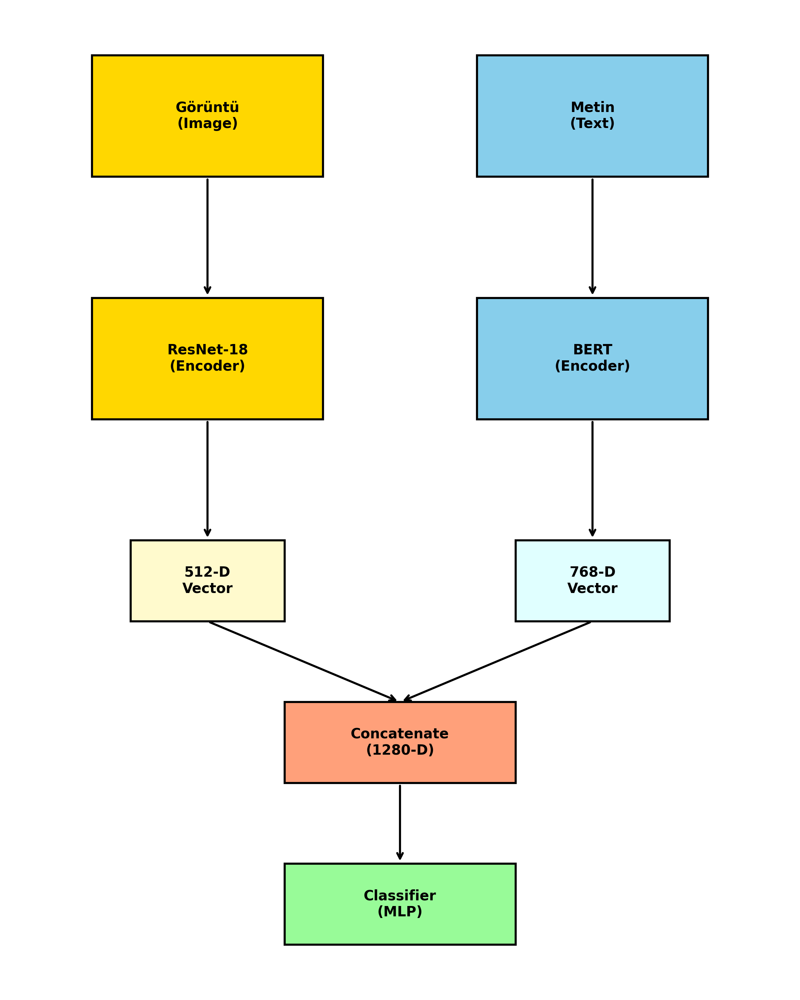
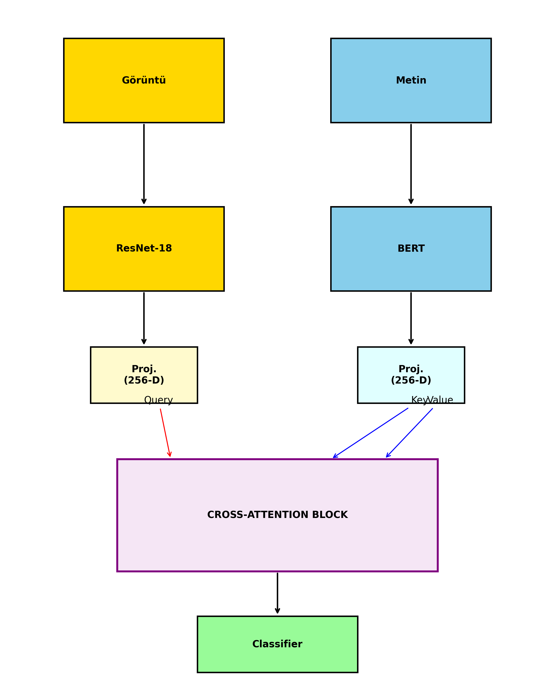
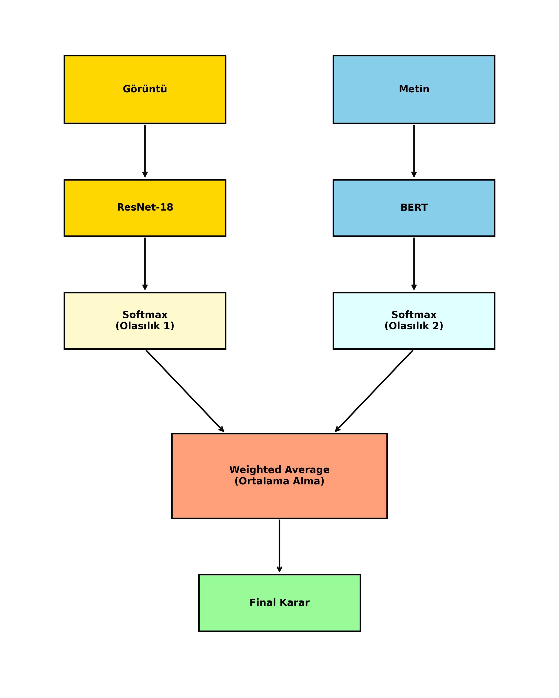
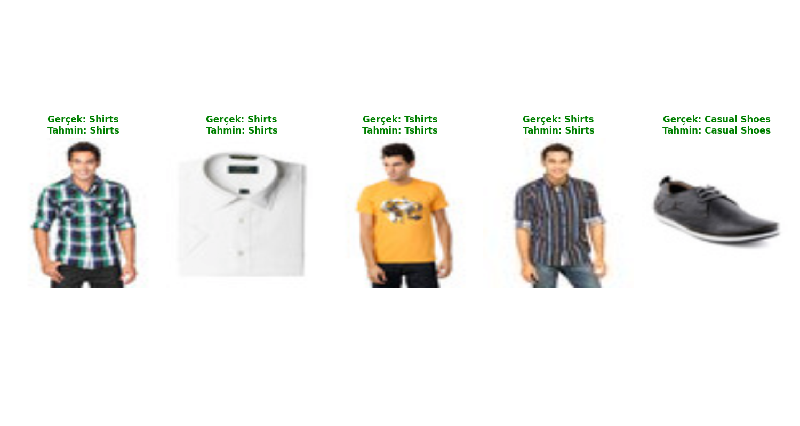
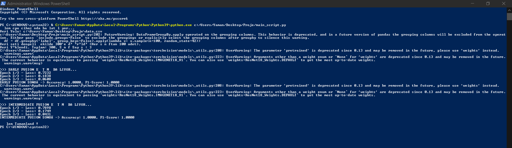

# Multimodal E-Commerce Product Classification 🛍️
Multimodal E-Commerce Product Classification DL - Multimodal Derin Öğrenme ile E-Ticaret Ürün Sınıflandırması

Bu proje, e-ticaret ürünlerini hem **görsel (ResNet-18)** hem de **metinsel (BERT)** özelliklerini kullanarak sınıflandıran çok modlu (multimodal) bir derin öğrenme modelidir. Tek bir modaliteye dayalı sistemlerin yetersiz kaldığı durumları aşmak için geliştirilmiştir.

## 🏗️ Proje Mimarisi

Aşağıdaki akış diyagramı, verinin girişten son karara kadar izlediği yolu ve uygulanan füzyon stratejilerini özetlemektedir:



---

## 🚀 Uygulanan Teknik Yöntemler

### 1. Modalite Modelleri

* **Görüntü (Image):** Ön eğitimli **ResNet-18** modeli kullanılarak 512 boyutlu öznitelik vektörü elde edilmiştir.
* **Metin (Text):** **BERT (bert-base-uncased)** modeli kullanılmış ve anlamsal özet taşıyan **[CLS] token** çıktısı (768-D) kullanılmıştır.

### 2. Füzyon Stratejileri

* **Early Fusion (Feature-Level):** Görüntü ve metin vektörleri birleştirilerek (concatenation) 1280 boyutlu tek bir vektör MLP sınıflandırıcısına verilmiştir.
* **Intermediate Fusion (Cross-Attention):** Modaliteler arası ilişkiyi öğrenmek için Cross-Attention mekanizması kullanılmıştır. Görüntü **"Query"**, metin ise **"Key/Value"** olarak atanmıştır.
* **Late Fusion (Decision-Level):** Ayrı modellerin Softmax çıktıları **"Ağırlıklı Ortalama"** yöntemiyle birleştirilmiştir.

---

## 📸 Mimari Görseller

### 1. Early Fusion Mimarisi

*Şekil 1: Öznitelik seviyesinde birleştirme mimarisi.*

### 2. Intermediate Fusion (Cross-Attention) Mimarisi

*Şekil 2: Çapraz dikkat mekanizması mimarisi.*

### 3. Late Fusion (Decision Level) Mimarisi

*Şekil 3: Karar seviyesinde füzyon mimarisi.*

### 4. Tahmin Örnekleri

*Şekil 4: Modelin test verisi üzerindeki başarılı tahmin örnekleri.*

---

## 📊 Performans Sonuçları

Eğitim sürecinde **Stratified Sampling** uygulanmış ve sonuçlar PyTorch kullanılarak elde edilmiştir.

| Model / Yöntem | Doğruluk (Accuracy) | F1-Score | Açıklama |
| --- | --- | --- | --- |
| ResNet18 (Image Only) | 0.9800 | 0.9800 | Tek modalite başarımı |
| BERT (Text Only) | 0.9900 | 0.9900 | Tek modalite başarımı |
| **Early Fusion** | **1.0000** | **1.0000** | Full Success |
| **Intermediate Fusion** | **1.0000** | **1.0000** | Full Success |
| **Late Fusion** | **1.0000** | **1.0000** | Full Success |

### Not: Veri seti boyutu ve modellerin güçlü ön eğitim ağırlıkları nedeniyle test setinde tam başarı sağlanmıştır.
---

## 💻 Kurulum ve Kullanım

### Bağımlılıkları Yükleyin:

```bash
pip install torch torchvision transformers pandas scikit-learn

```

### Eğitimi Başlatın:

```bash
python main_script.py

```
### Projeyi Çalıştırma Terminal Komutları (Örnektir)

### Not: Proje; eğitim, test aşamaları, veri seti oluşturma ve örnek tahmin görüntüleri oluşturma işlemleri dahil tamamen terminal komutları ile python tabanlı yardımcı araçların paketleri kullanılarak terminal komutları ile çalıştırılmaktadır.
---

**Hazırlayan:** Yaman CEYLAN
